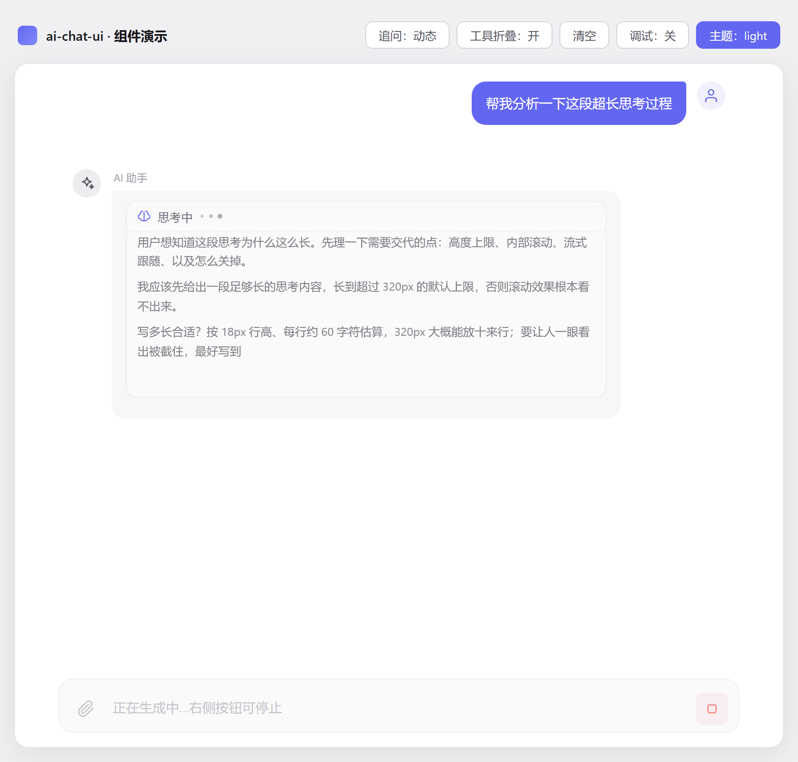
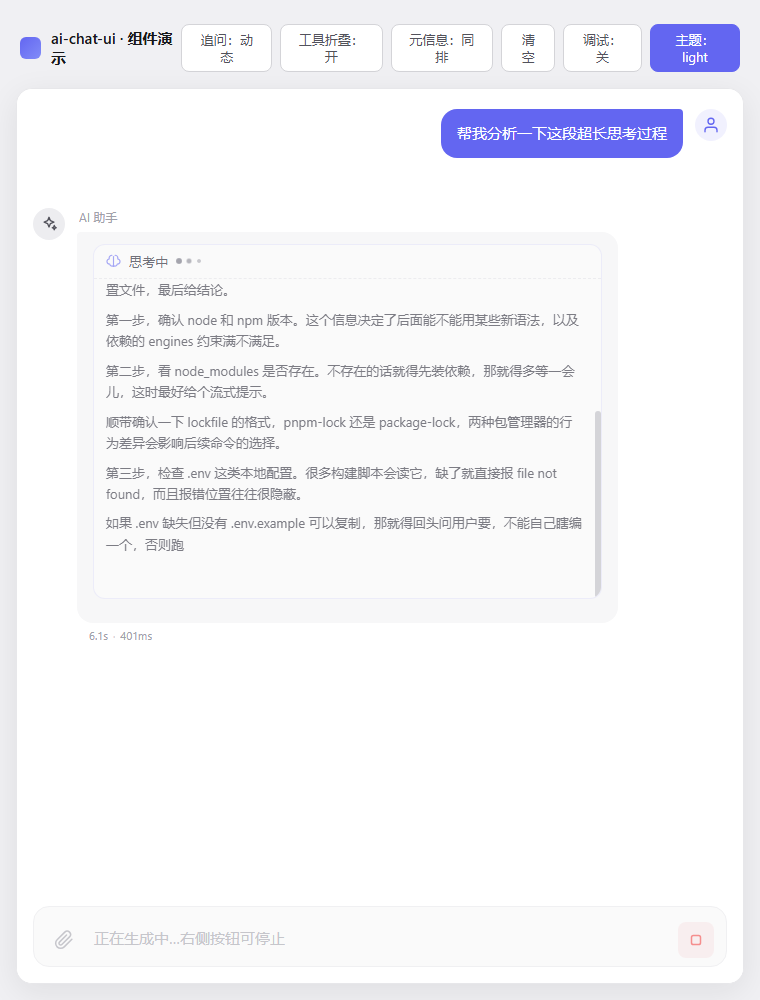
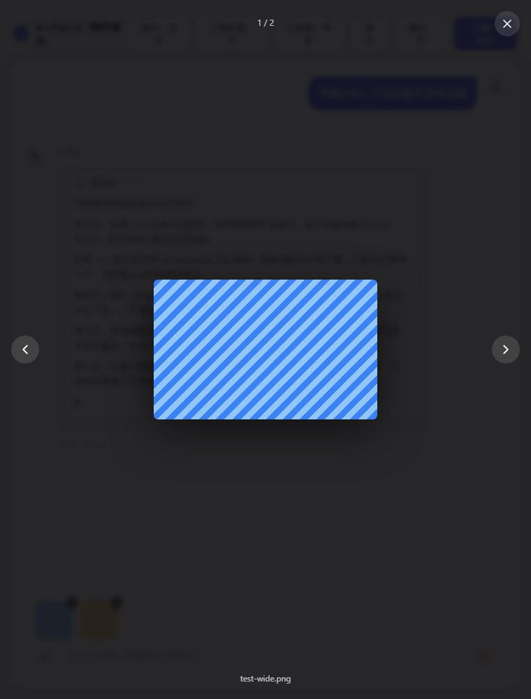
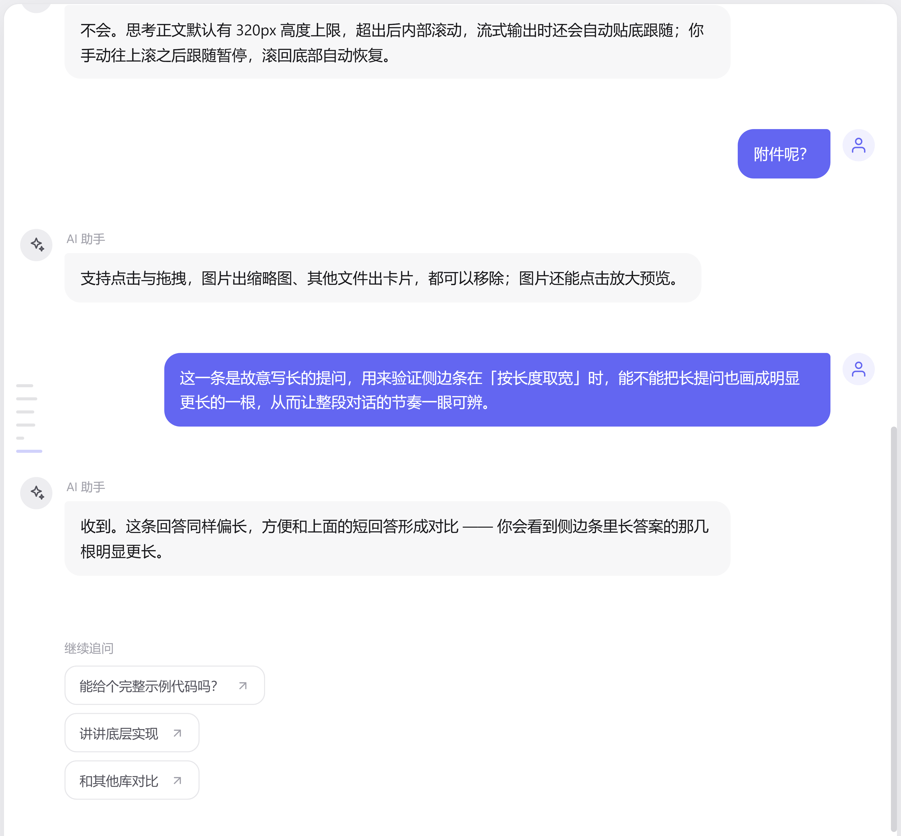
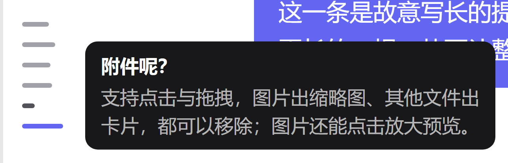
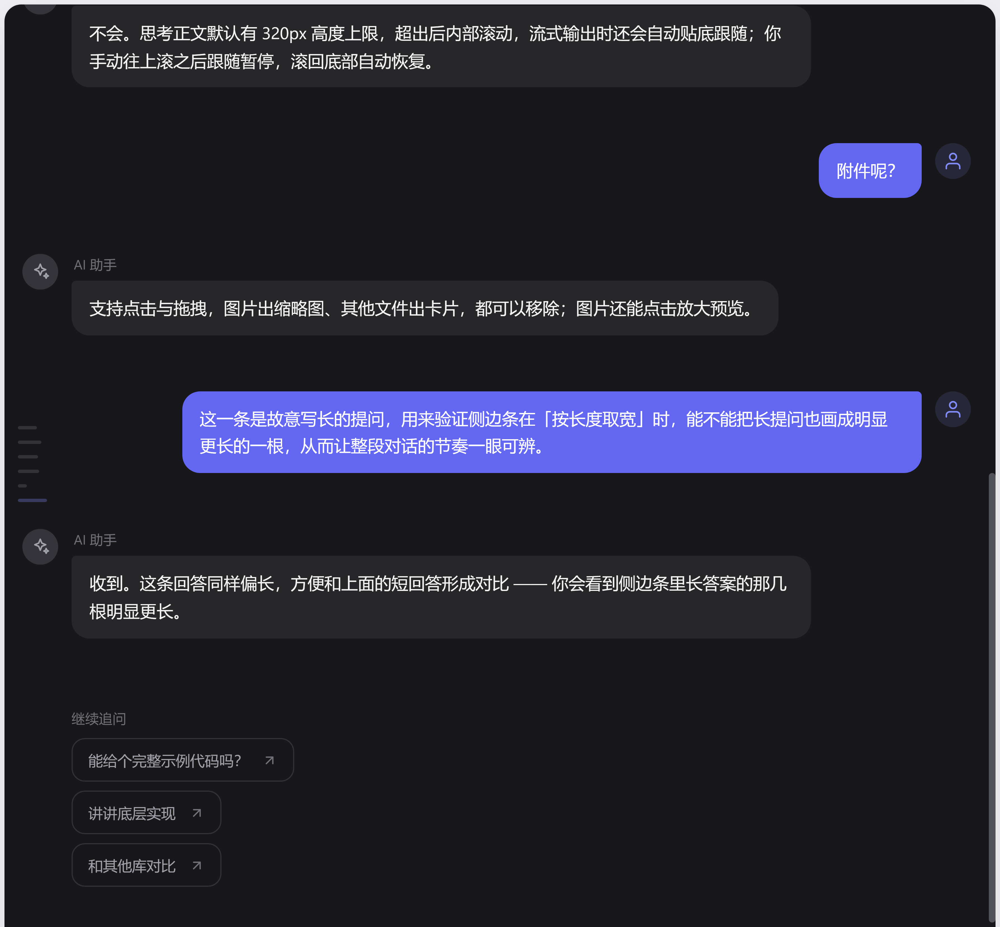
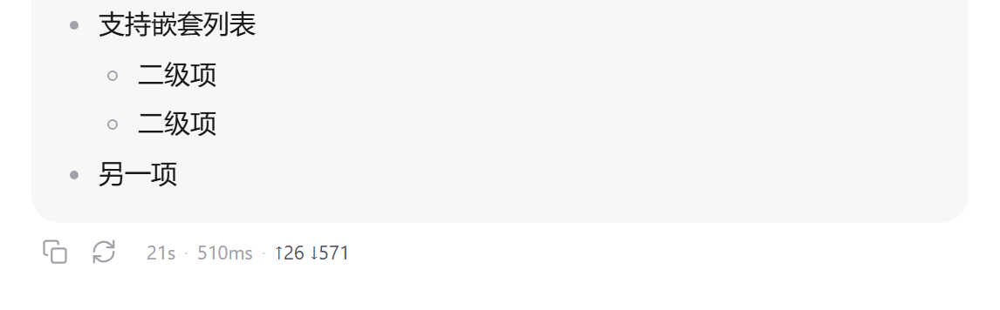
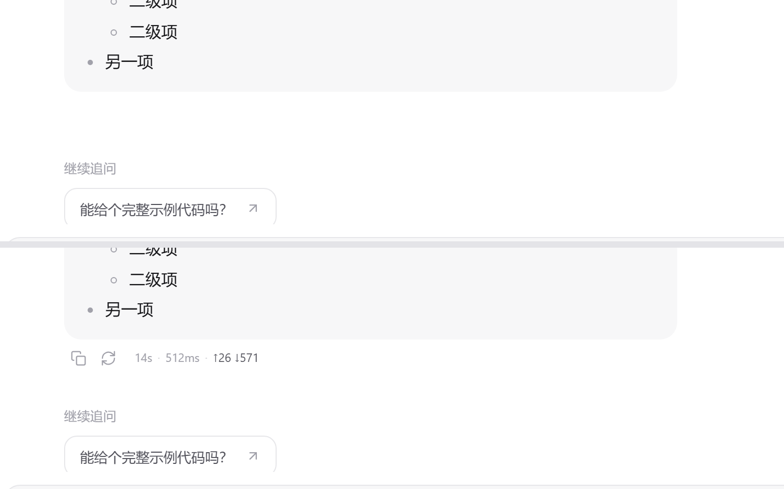
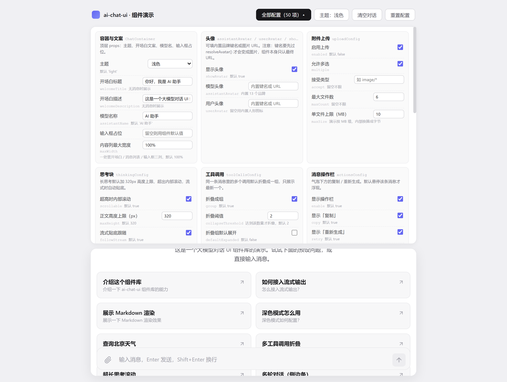

# zen-ai-chat-ui

一个精美的大模型对话 UI 组件库，基于 Vue 3 + TypeScript。支持流式输出、思考过程折叠、Markdown 渲染（Shiki 代码高亮）、附件上传、工具调用折叠、浅色/深色双主题。可发布到 NPM，供其他项目安装复用。

## 特性

- **流式输出**：逐字渲染 + 光标，支持 `content` / `reasoning` 双通道分片
- **停止生成**：生成中发送按钮自动变停止按钮，点击抛 `stop` 事件，由业务侧中断请求
- **思考过程**：独立的可折叠「思考中」区块，流式时展开 + 动画，完成后折叠；正文超高时内部滚动，不会把气泡撑得老长（滚动条默认悬停才淡入，不干扰阅读）
- **工具调用**：默认把同一条消息里的多个调用折叠成一组、只展示最新一个，点击可展开全部
- **消息操作栏**：气泡下方内置纯图标「复制」（提问 + 回答）与「重新生成」（回答），悬停该条消息才显示，复制带绿色对勾 + 浮层提示
- **运行元信息**：可选在气泡下方展示回答耗时、首字延迟、token 用量（`1.2s · 510ms · ↑26 ↓571`），耗时由 `useStreaming` 自动计时；与操作栏同步悬停显示（可设常显）
- **Markdown 渲染**：基于 markdown-it + Shiki，双主题代码高亮、表格、引用、任务列表，代码块带语言标签与一键复制
- **附件上传**：点击 / 拖拽，图片缩略图 + 文件卡片，可移除；图片点击可放大预览（灯箱：左右切换 / 键盘导航 / 点背景关闭）
- **消息侧边条**：消息列表左边缘一列短横条，**一轮问答一根**，条宽反映这一轮的篇幅；静止时低透明不打扰，悬停浮出「提问 + 回答摘要」，点击跳到该轮提问
- **开场白 + 预设问题**：首屏欢迎语 + 可点击的话题卡片
- **内容列宽度可配**：开场白、消息列表、输入框共享同一个 `maxWidth`（默认 `100%` 跟随容器），不会再出现「开场白 640 / 消息 768」那种对不齐
- **双主题**：浅色 / 深色 / 跟随系统，通过 CSS 变量驱动，可深度定制
- **样式自洽**：所有组件带 `acu-` 前缀，CSS 变量作用域隔离，不污染宿主

## 安装

```bash
npm install zen-ai-chat-ui
# 或
pnpm add zen-ai-chat-ui
```

`vue` 为 peerDependency，需 >= 3.3。`markdown-it` 与 `shiki` 为 dependency，会自动安装。

## 快速开始

```ts
import { createApp } from 'vue'
import App from './App.vue'
import 'zen-ai-chat-ui/style.css'

createApp(App).mount('#app')
```

```vue
<template>
  <ChatContainer
    :messages="messages"
    :preset-questions="questions"
    theme="light"
    @send="onSend"
  />
</template>

<script setup lang="ts">
import { ref } from 'vue'
import { ChatContainer, useStreaming, uid, type ChatMessage, type StreamChunk } from 'zen-ai-chat-ui'

const messages = ref<ChatMessage[]>([])
const streaming = useStreaming()

const questions = [
  { id: 'q1', label: '介绍一下你自己', prompt: '介绍一下你自己' }
]

async function onSend({ text, files }: { text: string; files: any[] }) {
  messages.value.push({
    id: uid('u'), role: 'user', content: text, status: 'done',
    attachments: files.map(f => ({ id: f.id, name: f.file.name, size: f.file.size, type: f.file.type, preview: f.preview }))
  })

  const assistant = streaming.createAssistant()
  messages.value.push(assistant)

  // 调用大模型接口，逐块 append
  for await (const chunk of callLLM(text)) {
    streaming.append(assistant, chunk as StreamChunk)
  }
}
</script>
```

## 流式输出

`useStreaming().append(message, chunk)` 按 `chunk.type` 分发：

| type        | delta         | 说明                     |
| ----------- | ------------- | ------------------------ |
| `reasoning` | 思考增量文本   | 写入 `message.reasoning` |
| `content`   | 正文增量文本   | 写入 `message.content`   |
| `done`      | -             | 标记完成                 |
| `error`     | -             | 标记错误                 |

首个 `content` 到达时，`reasoning` 自动标记为完成。

## 停止生成

生成过程中，输入框右侧的按钮会从「发送」变成「停止」，点击抛出 `stop` 事件，真正的中断由业务侧决定：



```vue
<script setup lang="ts">
import { ref } from 'vue'
import { ChatContainer } from 'zen-ai-chat-ui'

const busy = ref(false)
let aborter: AbortController | null = null

async function onSend({ text }: { text: string }) {
  busy.value = true
  aborter = new AbortController()
  try {
    const res = await fetch('/api/chat', {
      method: 'POST',
      body: JSON.stringify({ text }),
      signal: aborter.signal        // ← 关键：把 signal 交给 fetch
    })
    // ...流式读取 res.body 并 streaming.append()
  } finally {
    busy.value = false
    aborter = null
  }
}

function onStop() {
  aborter?.abort()                  // ← 真正中断请求
}
</script>

<template>
  <ChatContainer
    :messages="messages"
    :disabled="busy"
    :generating="busy"
    @send="onSend"
    @stop="onStop"
  />
</template>
```

组件本身不碰网络，`stop` 只是个信号。用 `fetch` 就传 `AbortController` 的 `signal`；用 SSE / WebSocket / 自研 SDK 就调各自的 `close()` / `cancel()`。

> 中断后组件不会把消息标成错误——已经产出的内容原样保留，由业务侧决定要不要补一句「（已停止生成）」之类的收尾文案。

### `disabled` 和 `generating` 是两件事

| 想要的交互 | 传什么 |
| --- | --- |
| 生成中锁住输入框（按钮变停止） | `:disabled="busy" :generating="busy"` |
| 生成中仍可继续输入下一条（按钮变停止） | 只传 `:generating="busy"` |
| 只是锁住输入，不要停止按钮 | 只传 `:disabled="busy"` |

第二种模式下 Enter 不会误发（`generating` 期间发送被拦掉），等生成结束再按 Enter 即可。

停止按钮用柔和的危险色：`--acu-error-soft` 作底、`--acu-error` 作图标色，覆盖这两个变量即可换色。

## 思考过程

assistant 消息的 `reasoning` 字段会渲染成一个独立的可折叠「思考中」区块：流式时自动展开 + 三点动画 + 光标，完成后自动折叠。

模型的思考过程动辄几千字，**默认给正文加了 320px 的高度上限，超出后内部滚动**，避免把气泡撑到几千像素高、把真正的回答挤到屏幕外：


滚动条默认**悬停时才淡入**，静止状态完全不干扰阅读（也可设为常显或彻底隐藏）：



```
┌─────────────────────────────────────────┐
│ ◐ 思考中 •••                           │  ← 头部常驻，随时可折叠
├─────────────────────────────────────────┤
│ 先看看项目结构……                    ▐   │  ← 正文：超出 320px 后内部滚动
│ Node v26.9.0，client engines 要求……  ▐   │
│ ……                                      │
└─────────────────────────────────────────┘
```

流式输出时正文会**自动贴底**跟随新内容；用户手动往上滚查看前文后跟随暂停，滚回底部自动恢复。滚动到边界不会把外层消息列表一起带走（`overscroll-behavior: contain`）。

### `ThinkingConfig` 字段

| 字段            | 类型      | 默认值  | 说明 |
| --------------- | --------- | ------- | ---- |
| `scrollable`    | `boolean` | `true`  | 正文超出高度上限时是否内部滚动；设 `false` 恢复为全部铺开 |
| `maxHeight`     | `number`  | `320`   | 正文最大高度（px） |
| `followStream`  | `boolean` | `true`  | 流式输出时是否自动贴底跟随 |
| `scrollbar`     | `'hover' \| 'always' \| 'hidden'` | `'hover'` | 正文滚动条显隐策略：悬停淡入 / 常显 / 完全隐藏（滚动能力都保留） |
| `defaultExpanded` | `boolean` | -     | 初始是否展开；不传则沿用默认（streaming 展开、完成折叠） |

```vue
<!-- 默认：320px 上限 + 内部滚动 + 流式跟随 -->
<ChatContainer :messages="messages" @send="onSend" />

<!-- 更长一些，且不要自动跟随（让用户自己滚） -->
<ChatContainer
  :messages="messages"
  :thinking-config="{ maxHeight: 480, followStream: false }"
  @send="onSend"
/>

<!-- 恢复旧行为：思考全部铺开 -->
<ChatContainer
  :messages="messages"
  :thinking-config="{ scrollable: false }"
  @send="onSend"
/>

<!-- 滚动条常显（默认是悬停才淡入） -->
<ChatContainer
  :messages="messages"
  :thinking-config="{ scrollbar: 'always' }"
  @send="onSend"
/>

<!-- 彻底不要滚动条（仍可滚动，只是不显示） -->
<ChatContainer
  :messages="messages"
  :thinking-config="{ scrollbar: 'hidden' }"
  @send="onSend"
/>
```

也可以单独用 `<ThinkingBlock>`：

```vue
<ThinkingBlock :content="msg.reasoning" :streaming="true" :config="{ maxHeight: 240 }" />
```

> 跑 `npm run dev` 后点预设里的「超长思考滚动」可以直接看到效果（含流式贴底跟随）。

> `scrollbar: 'hover'` 为什么不是纯 CSS？因为 Blink 在祖先 `:hover` 状态变化时**不会重算** `::-webkit-scrollbar-thumb` 的样式（`&:hover::-webkit-scrollbar-thumb` 实测无效），所以组件内部用 `mouseenter/mouseleave` 切一个 `is-scrollbar-visible` 类来驱动。这是经验证的实现细节，正常使用无需关心。

## 组件 API

### `<ChatContainer>`

主组件，组合消息列表、开场白、输入框。

| Prop                | 类型                       | 默认值     | 说明                  |
| ------------------- | -------------------------- | ---------- | --------------------- |
| `messages`          | `ChatMessage[]`            | -          | 消息列表（必填）      |
| `presetQuestions`   | `PresetQuestion[]`         | `[]`       | 预设问题              |
| `welcomeTitle`      | `string`                   | 见默认     | 开场白标题            |
| `welcomeDescription`| `string`                   | 见默认     | 开场白描述            |
| `assistantName`     | `string`                   | `'AI 助手'`| 模型名称              |
| `assistantAvatar`   | `string`                   | -          | 模型头像：图片 URL / data URL。想用内置品牌键名要先过 `resolveAvatar()`，见「内置 AI 品牌头像」 |
| `userAvatar`        | `string`                   | -          | 用户头像：图片 URL / data URL（同样支持 `resolveAvatar()`） |
| `showAvatar`        | `boolean`                  | `true`     | 是否显示头像          |
| `placeholder`       | `string`                   | 见默认     | 输入框占位文字        |
| `theme`             | `'light' \| 'dark' \| 'auto'` | `'light'`  | 主题                  |
| `disabled`          | `boolean`                  | `false`    | 禁用输入（生成中）    |
| `generating`        | `boolean`                  | `false`    | 生成中：发送按钮变停止按钮，点击抛 `stop` |
| `uploadConfig`      | `Partial<UploadConfig>`    | `{}`       | 附件上传配置          |
| `followup`          | `FollowupInput`            | -          | 追问建议（详见下方）  |
| `toolCallsConfig`   | `ToolCallsConfig`          | -          | 工具调用展示配置（详见下方） |
| `thinkingConfig`    | `ThinkingConfig`           | -          | 思考块展示配置（详见下方） |
| `actionsConfig`     | `MessageActionsConfig`     | -          | 气泡下方操作栏配置（详见下方） |
| `messageMetaConfig` | `MessageMetaConfig`        | -          | 耗时 / token 元信息行配置（详见下方） |
| `messageRailConfig` | `MessageRailConfig`        | -          | 侧边消息条配置（详见下方） |
| `maxWidth`          | `string \| number`         | `'100%'`   | 内容列最大宽度，一处管开场白 / 消息列表 / 输入框（详见下方） |

| Event              | Payload                                                | 说明             |
| ------------------ | ------------------------------------------------------ | ---------------- |
| `send`             | `{ text: string; files: SelectedFile[] }`              | 用户发送         |
| `select`           | `PresetQuestion`                                       | 点击预设问题     |
| `retry`            | `ChatMessage`                                          | 重试失败消息     |
| `followup-select`  | `(question: PresetQuestion, source: ChatMessage)`      | 点击追问建议     |
| `stop`             | -                                                      | 点击输入框右侧「停止生成」 |

### 其他可独立使用的组件

`MessageList`、`MessageBubble`、`ThinkingBlock`、`ToolCallBlock`、`ToolCallGroup`、`MessageActions`、`MessageMeta`、`MessageRail`、`WelcomeScreen`、`ChatInput`、`MarkdownRenderer`、`FollowupSuggestions`、`ImagePreview` 均已导出，可单独使用。

### 内容列宽度（`maxWidth`）

开场白的内容区、消息列表、输入框在视觉上是**同一列**，三者必须共用同一个上限。通过 `ChatContainer` 的 `maxWidth` 一处配置：

```vue
<ChatContainer :max-width="900" :messages="messages" />   <!-- 数字按 px -->
<ChatContainer max-width="60ch" :messages="messages" />   <!-- 字符串原样 -->
<ChatContainer :messages="messages" />                     <!-- 默认 '100%'，跟随容器 -->
```

- **默认 `'100%'`**：不再有内置上限，容器多宽内容就多宽。窄容器（移动端）无差别；大屏下铺满，不会缩在中间一小块、两侧大片留白。
- **数字**按 px 处理（`:max-width="900"` 与 `max-width="900px"` 等价）；字符串原样透传，`'60ch'`、`'72rem'` 也能用。
- 实现上是根节点注入一个 `--acu-max-width` CSS 变量，`WelcomeScreen` / `MessageList` / `ChatInput` 同时消费它。视觉上确实是同一列，就不会再出现列宽打架。
- 注意开场白外层 `.acu-welcome` 自带左右 padding，所以 `100%` 下开场白内容会比消息列表窄两个 padding（这是既有的内缩留白，不是上限）；设成具体值时三列严格等宽。

## 附件与图片预览

用户上传的图片既可以出现在输入框待发送区，也可以出现在已发送的 user 气泡里。两处的图片缩略图都支持**点击放大预览**。

- 缩略图带 `cursor: zoom-in` 与 `role="button"`，可键盘聚焦（Enter / Space 打开）
- 灯箱通过 `Teleport` 挂到 `body`，不受宿主容器 `overflow` 裁剪
- 多图时显示左右切换按钮与 `当前 / 总数` 计数；支持键盘 `←` `→` 切换、`Esc` 关闭、点背景关闭
- 灯箱底色固定为深色半透明（这是图片查看器的通用惯例），不跟随主题



图片附件通过 `message.attachments`（`ChatAttachment[]`）的 `preview` 字段提供预览地址：

```ts
const attachments: ChatAttachment[] = files.map(f => ({
  id: f.id,
  name: f.file.name,
  size: f.file.size,
  type: f.file.type,
  preview: f.preview    // 图片才有，指向可加载的 URL / data URL
}))
```

也可以单独用 `<ImagePreview>`：

```vue
<ImagePreview
  v-model:visible="previewVisible"
  v-model:index="previewIndex"
  :images="[{ src: '/a.png', name: 'a.png' }, { src: '/b.png', name: 'b.png' }]"
/>
```

| Prop      | 类型             | 默认值 | 说明 |
| --------- | ---------------- | ------ | ---- |
| `visible` | `boolean`        | `false`| 是否显示（用 `v-model:visible` 双向绑定） |
| `images`  | `PreviewImage[]` | `[]`   | 图片列表：`{ src: string; name?: string }` |
| `index`   | `number`         | `0`    | 当前第几张（用 `v-model:index` 双向绑定） |

| Event            | 说明 |
| ---------------- | ---- |
| `update:visible` | 关闭 / 打开时回传 |
| `update:index`   | 切换图片时回传 |

> 跑 `npm run dev` 后，把图片拖进输入框或直接发送，点缩略图即可看到灯箱效果。

## 消息侧边条

长对话翻起来容易迷路，这列贴在消息列表左边缘的短横条就是一张"目录"：**一轮问答一根条**
（用户提问开启新的一轮，其后到下一个提问之前的消息都算这一轮），条数随轮次增长。



- **条宽 = 这一轮的长度**（默认 `widthBy: 'length'`，对数缩放）：回答长的轮次明显更长，一段对话的节奏一眼可辨；流式输出时最后一根会跟着长出来，自带进度感
- **静止态低透明，悬停才显形**（`opacity: 0.3 → 1`），不读的时候不抢注意力
- **高亮跟随阅读位置**：以消息列表视口的垂直中心为基准，正在看的那一轮高亮
- **悬停浮出「提问 + 回答摘要」**（各 2 行钳制），用来定位而不用真去读



- **点击跳转**：平滑滚动到**这一轮的提问**处，落在视口顶部
- 深色主题自动跟随：



### `MessageRailConfig` 字段

| 字段            | 类型                  | 默认值      | 说明 |
| --------------- | --------------------- | ----------- | ---- |
| `enable`        | `boolean`             | `false`     | 是否启用。默认关闭——会话不长时它属于多余噪音，建议显式打开 |
| `widthBy`       | `'length' \| 'even'`  | `'length'`  | 条宽依据：按本轮长度（对数），或全部等宽 |
| `minWidth`      | `number`              | `8`         | 最短条宽（px） |
| `maxWidth`      | `number`              | `26`        | 最长条宽（px） |
| `barHeight`     | `number`              | `3`         | 条高（px） |
| `maxGap`        | `number`              | `10`        | 条间最大间距（px）。轮次多时自动压缩（下限 4px） |
| `maxHeight`     | `number`              | `320`       | 条组最大高度（px），超出后条组内部滚动并把当前条带回视野 |
| `idleOpacity`   | `number`              | `0.3`       | 静止态整体透明度；悬停或键盘聚焦时整组显形 |
| `showTooltip`   | `boolean`             | `true`      | 悬停单根条是否显示浮层 |
| `clickToScroll` | `boolean`             | `true`      | 点击条是否滚动到该轮提问 |

```vue
<!-- 按本轮长度取宽（默认） -->
<ChatContainer
  :messages="messages"
  :message-rail-config="{ enable: true }"
  @send="onSend"
/>

<!-- 全部等宽：只想看「聊了几轮」、不关心长短时更整齐 -->
<ChatContainer
  :messages="messages"
  :message-rail-config="{ enable: true, widthBy: 'even' }"
  @send="onSend"
/>

<!-- 更细更密，适合轮次很多的场景 -->
<ChatContainer
  :messages="messages"
  :message-rail-config="{ enable: true, barHeight: 2, maxGap: 6, idleOpacity: 0.2 }"
  @send="onSend"
/>
```

也可以单独用 `<MessageRail>`（它是 `position: absolute`，宿主需要有定位上下文）：

```vue
<div style="position: relative">
  <MessageRail :messages="messages" :active-id="activeId" :config="{ enable: true }" />
</div>
```

> 跑 `npm run dev` 后点预设里的「多轮对话（侧边条）」会一次铺出多轮对话，顶部「全部配置」面板里可切「按长度 / 等宽」。

## 工具调用

assistant 消息通过 `message.toolCalls` 携带工具调用列表：

```ts
const assistant = streaming.createAssistant()
assistant.toolCalls = [
  { id: 'tc1', name: 'read_file', argsPreview: 'path=package.json', status: 'running' }
]
// 执行完成后回填
assistant.toolCalls[0].status = 'done'
assistant.toolCalls[0].result = '{ "name": "my-app" }'
```

一条消息里连续出现十几个调用时，平铺会把气泡撑得很长。**默认行为**是自动折叠成一组、**只展示最新（最后一次）的调用**，点击组头即可展开全部：

```
┌───────────────────────────────────────────┐
│ ✓ ⧉ 已调用 12 个工具              全部 ⌄  │  ← 组头：聚合状态 + 数量
├───────────────────────────────────────────┤
│ ✓ 🔧 read_file  path=src/App.vue      ⌄  │  ← 折叠态只保留最新一个
└───────────────────────────────────────────┘
```

组头状态聚合规则：有调用在跑显示 `正在调用工具 3/12`；全部结束显示 `已调用 12 个工具`；有失败追加 `· 2 个失败`。

### `ToolCallsConfig` 字段

| 字段                 | 类型      | 默认值  | 说明 |
| -------------------- | --------- | ------- | ---- |
| `group`              | `boolean` | `true`  | 是否折叠成组；设为 `false` 恢复为平铺渲染全部调用 |
| `collapseThreshold`  | `number`  | `2`     | 调用数量达到该值时才折叠（最小生效值 2）；只有 1 个调用时不会出现组头 |
| `defaultExpanded`    | `boolean` | `false` | 折叠组默认是否展开 |

```vue
<!-- 默认：折叠，只展示最新一个 -->
<ChatContainer :messages="messages" @send="onSend" />

<!-- 平铺：全部调用一次列出 -->
<ChatContainer :messages="messages" :tool-calls-config="{ group: false }" @send="onSend" />

<!-- 5 个以上才折叠，且默认展开 -->
<ChatContainer
  :messages="messages"
  :tool-calls-config="{ collapseThreshold: 5, defaultExpanded: true }"
  @send="onSend"
/>
```

### 单独使用 `<ToolCallGroup>`

```vue
<ToolCallGroup :tool-calls="msg.toolCalls ?? []" :config="{ defaultExpanded: true }" />
```

## 消息操作栏

每条消息气泡下方有一排**纯图标**按钮，默认隐藏，**鼠标悬停到该条消息上才会淡入**：

- **复制**（图标）：`user` 与 `assistant` 消息都有，复制的是 Markdown 原文；assistant 会自动剥离 `<think>` 思考段，只复制可见答案。复制成功后图标变绿色对勾，并冒一个「已复制」浮层提示（默认停留 1.6s）。
- **重新生成**（图标）：仅 `assistant` 消息，默认**只出现在最后一条**回答上，且流式进行中会隐藏。点击后抛出 `retry` 事件，由业务侧决定如何重跑。

两个按钮都带 `title` 与 `aria-label`，纯图标也不影响可访问性。

```vue
<ChatContainer
  :messages="messages"
  @send="onSend"
  @retry="(msg) => regenerate(msg)"
/>
```

> **显隐规则**：只在支持 hover 的设备（`@media (hover: hover)`）上做悬停隐藏；触摸设备没有 hover，按钮会一直可见，否则用户永远点不到。键盘 `Tab` 聚焦到按钮时同样会显示（`:focus-within`）。

### `MessageActionsConfig` 字段

| 字段              | 类型      | 默认值   | 说明 |
| ----------------- | --------- | -------- | ---- |
| `enable`          | `boolean` | `true`   | 是否显示整条操作栏；设 `false` 全部隐藏 |
| `copy`            | `boolean` | `true`   | 是否显示「复制」 |
| `retry`           | `boolean` | `true`   | 是否显示「重新生成」 |
| `retryOnlyLast`   | `boolean` | `true`   | 只挂在最后一条 assistant 上；设 `false` 则历史回答也显示 |
| `copiedDuration`  | `number`  | `1600`   | 「已复制」提示停留时长（毫秒） |

```vue
<!-- 关闭整个操作栏 -->
<ChatContainer :messages="messages" :actions-config="{ enable: false }" />

<!-- 只保留复制，且历史回答也给重新生成 -->
<ChatContainer
  :messages="messages"
  :actions-config="{ retryOnlyLast: false }"
/>
```

> 复制优先使用 `navigator.clipboard`（要求 HTTPS / localhost 等安全上下文），不可用时自动退回 `textarea + execCommand`，兼容 http 内网部署。错误态消息仍在气泡内保留「重试」按钮，操作栏不再重复。

### 单独使用 `<MessageActions>`

`MessageActions` 自身不带悬停隐藏逻辑（那由父容器决定），独立使用时常显：

```vue
<MessageActions role="assistant" :copy-text="answer" :show-retry="true" @retry="onRetry" />
```

## 运行元信息（耗时 / token）

在气泡下方多出一行 `21s · 510ms · ↑26 ↓571`，告诉你这次回答花了多久、吐了多少 token。



**默认关闭**，需要显式打开——它是新增的可见元素，默认打开会让所有既有页面的每条消息都多一行：

```vue
<ChatContainer
  :messages="messages"
  :message-meta-config="{ enable: true }"
  @send="onSend"
/>
```

### 耗时是自动的，token 不是

耗时不需要你做任何事：`useStreaming` 在 `createAssistant` 时记下 `createdAt`，第一个分片到达时记下 `firstTokenAt`，`finish()` 时记下 `finishedAt` 并把折算结果写进 `message.meta`。

**token 必须你自己塞**，因为它只能来自接口响应（OpenAI 用 `usage.prompt_tokens`，Anthropic 用 `usage.input_tokens`，字段名各家不同）：

```ts
const assistant = streaming.createAssistant()
messages.value.push(assistant)

const res = await fetch('/api/chat', { method: 'POST', signal: ctrl.signal, body })
for await (const chunk of parseSSE(res)) {
  streaming.append(assistant, chunk)
}

// 流结束后通常还会来一个带 usage 的收尾事件
assistant.meta = {
  ...(assistant.meta ?? {}),
  usage: {
    prompt: usage.prompt_tokens,
    completion: usage.completion_tokens,
    total: usage.total_tokens,
    reasoning: usage.completion_tokens_details?.reasoning_tokens,
    cached: usage.prompt_tokens_details?.cached_tokens
  }
}
streaming.finish(assistant)
```

> 组件库**不做 token 估算**。按字符数猜出来的数字看着像真的，但会误导用户，比不显示更糟。

### `MessageMetaConfig` 字段

| 字段 | 类型 | 默认值 | 说明 |
| --- | --- | --- | --- |
| `enable` | `boolean` | `false` | 是否展示元信息行 |
| `items` | `MessageMetaItem[]` | `['duration', 'tokens']` | 展示哪些项，按数组顺序渲染。可选 `duration`（耗时）/ `firstToken`（首字延迟）/ `tokens` / `time`（发送时间） |
| `position` | `'inline' \| 'below'` | `'inline'` | `inline` 与操作栏同一行、`below` 单独占一行 |
| `showForUser` | `boolean` | `false` | 是否也给 user 消息显示（user 侧通常只有 `time` 有意义） |
| `visibility` | `'always' \| 'hover'` | `'hover'` | 显隐时机。`hover` 与操作栏一致：悬停该条消息 / 键盘聚焦才淡入；`always` 常显 |

> **显隐规则**：元信息和操作栏在同一行，默认都走「悬停才淡入」，**一起出现、一起消失**——避免出现「一个常驻、一个浮现」的参差感。同样是 `opacity` 切换，盒子一直在，不产生布局抖动。



> 触摸设备（`@media (hover: none)`）上 `'hover'` 会自动退化为常显：没有悬停这个动作，藏起来等于用户永远看不到。这一条对操作栏和元信息同样适用。
>
> 不想让它藏，传 `visibility: 'always'`：

```vue
<!-- 元信息常显（和旧版行为一致） -->
<ChatContainer
  :messages="messages"
  :message-meta-config="{ enable: true, visibility: 'always' }"
  @send="onSend"
/>
```

### 改展示内容

```vue
<!-- 只留「首字延迟 + token」，换行排布，user 侧也显示发送时间 -->
<ChatContainer
  :messages="messages"
  :message-meta-config="{
    enable: true,
    items: ['firstToken', 'tokens', 'time'],
    position: 'below',
    showForUser: true
  }"
/>
```

### 附加自定义项

`meta.extra` 里的内容会原样追加到末尾，用来塞模型名、检索命中数这类业务字段：

```ts
assistant.meta = {
  ...assistant.meta,
  extra: [{ label: '模型', value: 'MiniMax-M3', title: '本次使用的模型' }]
}
```

渲染结果：`21s · 510ms · ↑26 ↓571 · 模型 MiniMax-M3`

### 逐字段自定义消息

不用 `useStreaming` 也可以，直接把时间戳和用量写在消息对象上：

```ts
messages.value.push({
  id: 'a1',
  role: 'assistant',
  content: answer,
  status: 'done',
  createdAt: t0,          // 可选：不传则耗时项不显示
  finishedAt: t1,
  firstTokenAt: t0 + 510,
  meta: { usage: { prompt: 26, completion: 571 } }
})
```

> 耗时优先取 `meta.durationMs`，其次用 `finishedAt - createdAt` 推导。两者都没有时该项自动隐藏，不会显示 `NaN`。

### 「重新生成」要清计时状态

只重置 `content` 会让旧的 `finishedAt` / `firstTokenAt` 留着，新一次生成算出来的耗时是从上一次开始算的——这个 bug 很隐蔽，因为数字看着仍然「像个耗时」。用导出的小工具一把清干净：

```ts
import { resetStreamTiming } from 'zen-ai-chat-ui'

function onRetry(msg: ChatMessage) {
  msg.content = ''
  msg.reasoning = ''
  msg.error = undefined
  msg.status = 'streaming'
  resetStreamTiming(msg)   // 重置 createdAt / finishedAt / firstTokenAt / meta
  runStream(msg)
}
```

### 单独使用 `<MessageMeta>`

它只依赖消息对象，可以塞进自己的气泡组件里：

```vue
<MessageMeta :message="msg" :config="{ items: ['duration', 'tokens'] }" />
```

> `MessageMeta` 自身**不带**悬停隐藏逻辑（和 `MessageActions` 一样，那由父容器决定），独立使用时常显。上面说的「默认悬停」是 `MessageBubble` 配合 `visibility: 'hover'` 做出来的效果。

配套的格式化函数也导出了，方便你在别处复用同一套口径：`formatDuration(1234) === '1.2s'`、`formatTokens(12345) === '1.2万'`、`formatClock(Date.now()) === '14:32'`。

## 内置 AI 品牌头像

除了让用户自己填头像 URL，组件库还内置了 13 个知名 AI 产品的头像，零配置直接用。


```vue
<script setup lang="ts">
import { ChatContainer, AI_AVATARS, resolveAvatar } from 'zen-ai-chat-ui'
</script>

<template>
  <!-- 1) 直接按键名取用（有类型提示，写错会报错） -->
  <ChatContainer :messages="messages" :assistant-avatar="AI_AVATARS.claude" />

  <!-- 2) 业务里存的是厂商字符串时，用 resolveAvatar 兜底 -->
  <ChatContainer :messages="messages" :assistant-avatar="resolveAvatar(model.provider)" />
</template>
```

`resolveAvatar` 的设计意图是**透传**：已知键名返回内置头像，未知值原样返回。所以你可以放心把「数据库里的厂商名 or 用户自填的 URL or emoji」直接丢给它，不用写 `if/else`。

### 可用键名

`claude` · `codex` · `kimi` · `opencode` · `zcode` · `openai` · `gemini` · `mistral` · `copilot` · `cursor` · `perplexity` · `ollama` · `huggingface`

对应的具名导出为 `avatarClaude`、`avatarCodex`…，也可以按需 tree-shaking 引入：

```ts
import { avatarClaude } from 'zen-ai-chat-ui'
```

### 渲染「选择头像」列表

`AI_AVATAR_PRESETS` 提供每个头像的元信息（`key` / `name` / `vendor` / `color` / `src`），适合直接 `v-for` 成头像选择器：

```vue
<script setup lang="ts">
import { AI_AVATAR_PRESETS } from 'zen-ai-chat-ui'

const emit = defineEmits<{ pick: [key: string] }>()
</script>

<template>
  <button
    v-for="p in AI_AVATAR_PRESETS"
    :key="p.key"
    :title="`${p.name} · ${p.vendor}`"
    @click="emit('pick', p.key)"
  >
    
  </button>
</template>
```

### 单条消息覆盖头像

`assistant-avatar` / `user-avatar` 是**全局**配置。如果某一条消息想单独换头像（比如一个会话里切换了模型、或者用户给自己起了不同形象），直接在该条消息上写 `avatar`：

```ts
messages.value.push({
  id: 'u1',
  role: 'user',
  content: '你好',
  avatar: 'https://example.com/me.png', // 这条消息专属，优先级高于 user-avatar
  status: 'done'
})
```

优先级为 **`message.avatar` > 全局 prop > 内置 svg 兜底**。`user` 与 `assistant` 两种角色都支持；想还原成「跟随全局」，把该字段删掉（或置为 `''`）即可。

### 说明

- 所有头像都会被规范化成 **64×64、白色圆底**的 SVG data URL，并以**几何平均边长**对齐视觉尺寸——宽扁的 Logo（如 Claude）不会被缩得比方形 Logo 小一圈。全部 13 个合计约 18.8 KB，已在包内，运行时零请求。
- 源 SVG 保留在 `src/avatars/svg/`，生成脚本是 `scripts/build-avatars.mjs`（`npm run build:avatars`）。**`src/avatars/index.ts` 是生成产物，请勿手改**。
- 许可：`simple-icons` 来源的部分为 CC0 1.0；其余为各厂商官方标识，版权归各自所有者，此处仅用于指代对应产品。详见 [`src/avatars/README.md`](src/avatars/README.md)。

## 追问建议

每轮 assistant 回复完成后，会在该条气泡下方独立区域展示一组「继续追问」按钮。宽度自适应内容，超过上限会单行省略。

### 基础用法（静态追问）

直接把数组传给 `followup`：

```vue
<ChatContainer
  :messages="messages"
  :followup="[
    { id: '1', label: '举个例子', prompt: '能举个例子吗？' },
    { id: '2', label: '深入讲讲原理', prompt: '详细讲讲它的原理' },
    { id: '3', label: '和其他方案对比', prompt: '和同类方案相比呢？' }
  ]"
/>
```

点击追问按钮会自动触发 `send` 事件（payload 为 `{ text: q.prompt, files: [] }`），等同于用户手动发送。

### 高级用法（动态生成）

传 `FollowupConfig` 对象，启用 `provider` 异步生成追问。每轮 assistant 完成时会自动调用：

```vue
<ChatContainer
  :messages="messages"
  :followup="{
    title: '你可能还想问',
    mode: 'latest',
    provider: async (lastMessage, history) => {
      const res = await fetch('/api/followup', {
        method: 'POST',
        body: JSON.stringify({ last: lastMessage, history })
      })
      return (await res.json()).questions
    }
  }"
  @followup-select="(q, source) => console.log('clicked', q, source)"
/>
```

### `FollowupConfig` 字段

| 字段                  | 类型                                              | 默认值            | 说明 |
| --------------------- | ------------------------------------------------- | ----------------- | ---- |
| `items`               | `PresetQuestion[]`                                | -                 | 静态追问列表；与 `provider` 同时传时优先用 items |
| `provider`            | `(last, history) => PresetQuestion[] \| Promise`  | -                 | 动态生成追问；返回 `Promise` 时会展示 loading 骨架 |
| `title`               | `string`                                          | `'继续追问'`      | 区段标题 |
| `mode`                | `'after-answer' \| 'latest'`                      | `'latest'`        | `'latest'` 只展示最后一条消息的追问；`'after-answer'` 每条完成的 assistant 都展示 |
| `showDuringStreaming` | `boolean`                                         | `false`           | 是否在 assistant 流式输出过程中就展示（默认等回复完成） |
| `autoSend`            | `boolean`                                         | `true`            | 点击追问是否自动作为用户消息发送；设为 `false` 则只触发 `followup-select` 事件 |

### 单独使用 `<FollowupSuggestions>`

如果想完全自定义位置 / 嵌入其他场景，直接用组件：

```vue
<FollowupSuggestions
  :items="[{ id: '1', label: '再讲讲', prompt: '再讲讲' }]"
  title="你可能还想问"
  @select="onPick"
/>
```

## 主题定制

覆盖任意 CSS 变量即可换肤，变量定义于 `:root`，切换深色用 `[data-theme="dark"]`：

```css
:root {
  --acu-primary: #10b981;       /* 主色 */
  --acu-bubble-user-bg: #10b981;/* 用户气泡背景 */
  --acu-radius: 14px;           /* 圆角 */
}
```

## 本地开发

```bash
npm install
npm run dev      # 启动调试（http://127.0.0.1:7788）
npm run build    # 构建组件库产物（dist/）
npm run release  # 一键发版（见下）
```

### 演示页的「全部配置」面板

`npm run dev` 打开的演示页顶栏有一个 **全部配置** 按钮（按钮上直接显示当前项数，如「全部配置（50 项）」），
展开后按 prop 分组列出组件库对外暴露的**每一个可配置项**——改一下立刻能看到对话区的变化，不用去翻文档。



面板由 `dev/App.vue` 里的一份 `SCHEMA` 驱动：每个字段声明 `{ key, label, field, type, options, hint }`
就能自动渲染出对应控件（开关 / 下拉 / 数字 / 文本 / 多选），条目计数和「重置配置」也会自动跟上。
新增一个配置项时只需往 `SCHEMA` 补一行，不会再出现「文档里有、演示里没有」。

演示页还支持 `?maxWidth=900` 这样的 URL 参数来初始化内容列宽度，方便直接截图对比。

## 发布

```bash
npm run release -- --dry-run   # 先看一遍计划，不写文件 / 不提交 / 不发布
npm run release                # 正式发版
```

脚本（`scripts/release.js`）按顺序做 8 件事：

1. **环境检查** —— git 仓库 / 分支 / 清理遗留 `*.lock` / 工作区干净 / `npm whoami` 已登录
2. **更新版本号** —— 同步写 `package.json` 与 `package-lock.json`
3. **构建** —— `npm run build`（含 `vue-tsc` 类型检查）
4. **发布物自检** —— 见下
5. **版本占用检查** —— registry 上已存在同名版本则中止
6. **提交并打 tag** —— 只 stage `package.json` / `package-lock.json`，然后 `git push` + `git push --tags`
7. **发布** —— `npm publish --tag <dist-tag>`
8. **发布后校验** —— 轮询 registry 直到该版本可见，并检查 dist-tags 没被污染

### 常用参数

| 参数 | 说明 |
| --- | --- |
| `--dry-run` | 只打印计划。**构建与 `npm pack` 仍会真跑**，因为发布物自检必须基于真实产物 |
| `--skip-push` | 提交但不 push |
| `--skip-publish` | 只到提交为止，不发 npm |
| `--skip-build` | 跳过构建（自检会基于旧 `dist`，慎用） |
| `--yes` / `-y` | 所有询问取默认答案 |
| `--version=0.1.0` | 指定版本号；不传则自动递增（`0.1.0-beta.7` → `0.1.0-beta.8`）。**从预发布转正式版必须显式指定** |
| `--tag=next` | 覆盖 npm dist-tag |

### dist-tag 是自动的，这点很重要

`0.1.0-beta.8` 这类带预发布标识的版本会自动发到 `beta` 标签，而不是 `latest`。

npm 本身**不会**替你避开 `latest`——不加 `--tag` 就会把 beta 顶成 `latest`，让所有 `npm i zen-ai-chat-ui` 的消费方装到 beta 版。脚本会强制带上 `--tag`，并在第 8 步复查 `latest` 有没有被预发布版本污染。

### 发布物自检（第 4 步）为什么必须存在

`package.json#files` 是逐条列举的白名单，缺文件的问题**在本地永远复现不了**（本地有全部文件），只有把真实 tarball 清单拉出来比对才发现得了。脚本用三道互相独立的网卡住：

| 检查 | 拦住的问题 |
| --- | --- |
| ① `dist/` 关键工件存在 | `vite.config.ts` 的 `lib.fileName` / `assetFileNames` 被改动导致产物改名（消费方 `import 'zen-ai-chat-ui/style.css'` 会直接 404） |
| ② 真实 `npm pack --dry-run` 清单 | `files` 白名单里的东西被 `.npmignore` / `.gitignore` 反手排除 |
| ③ `main` / `module` / `types` / `exports` 指向的文件确实在包里 | 改了目录结构却漏改 `exports`，消费方 import 时模块解析失败 |

任一失败都会中止发布，不会产生"发出去才发现装不上"的包。

## License

MIT
