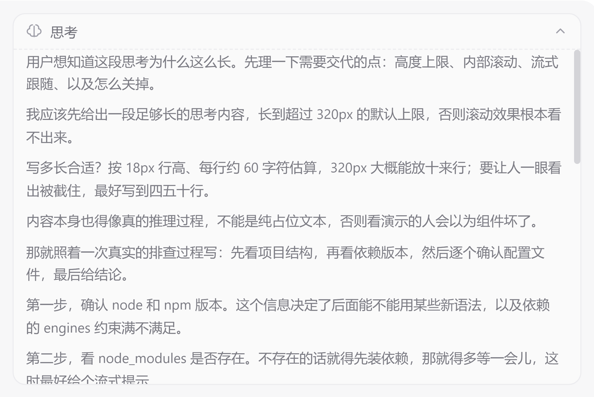
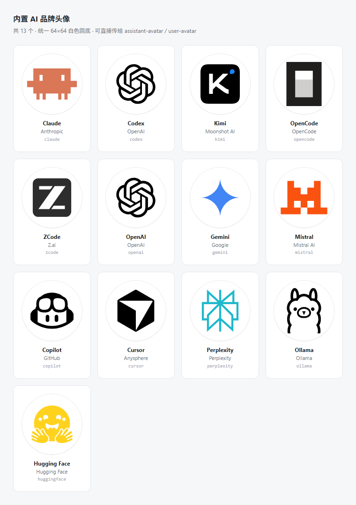

# zen-ai-chat-ui

一个精美的大模型对话 UI 组件库，基于 Vue 3 + TypeScript。支持流式输出、思考过程折叠、Markdown 渲染（Shiki 代码高亮）、附件上传、工具调用折叠、浅色/深色双主题。可发布到 NPM，供其他项目安装复用。

## 特性

- **流式输出**：逐字渲染 + 光标，支持 `content` / `reasoning` 双通道分片
- **思考过程**：独立的可折叠「思考中」区块，流式时展开 + 动画，完成后折叠；正文超高时内部滚动，不会把气泡撑得老长
- **工具调用**：默认把同一条消息里的多个调用折叠成一组、只展示最新一个，点击可展开全部
- **消息操作栏**：气泡下方内置纯图标「复制」（提问 + 回答）与「重新生成」（回答），悬停该条消息才显示，复制带绿色对勾 + 浮层提示
- **Markdown 渲染**：基于 markdown-it + Shiki，双主题代码高亮、表格、引用、任务列表，代码块带语言标签与一键复制
- **附件上传**：点击 / 拖拽，图片缩略图预览，文件卡片，可移除
- **开场白 + 预设问题**：首屏欢迎语 + 可点击的话题卡片
- **双主题**：浅色 / 深色 / 跟随系统，通过 CSS 变量驱动，可深度定制
- **样式自洽**：所有组件带 `acu-` 前缀，CSS 变量作用域隔离，不污染宿主

## 安装

```bash
npm install zen-ai-chat-ui
# 或
pnpm add zen-ai-chat-ui
```

`vue` 为 peerDependency，需 >= 3.3。`markdown-it` 与 `shiki` 为 dependency，会自动安装。

## 快速开始

```ts
import { createApp } from 'vue'
import App from './App.vue'
import 'zen-ai-chat-ui/style.css'

createApp(App).mount('#app')
```

```vue
<template>
  <ChatContainer
    :messages="messages"
    :preset-questions="questions"
    theme="light"
    @send="onSend"
  />
</template>

<script setup lang="ts">
import { ref } from 'vue'
import { ChatContainer, useStreaming, uid, type ChatMessage, type StreamChunk } from 'zen-ai-chat-ui'

const messages = ref<ChatMessage[]>([])
const streaming = useStreaming()

const questions = [
  { id: 'q1', label: '介绍一下你自己', prompt: '介绍一下你自己' }
]

async function onSend({ text, files }: { text: string; files: any[] }) {
  messages.value.push({
    id: uid('u'), role: 'user', content: text, status: 'done',
    attachments: files.map(f => ({ id: f.id, name: f.file.name, size: f.file.size, type: f.file.type, preview: f.preview }))
  })

  const assistant = streaming.createAssistant()
  messages.value.push(assistant)

  // 调用大模型接口，逐块 append
  for await (const chunk of callLLM(text)) {
    streaming.append(assistant, chunk as StreamChunk)
  }
}
</script>
```

## 流式输出

`useStreaming().append(message, chunk)` 按 `chunk.type` 分发：

| type        | delta         | 说明                     |
| ----------- | ------------- | ------------------------ |
| `reasoning` | 思考增量文本   | 写入 `message.reasoning` |
| `content`   | 正文增量文本   | 写入 `message.content`   |
| `done`      | -             | 标记完成                 |
| `error`     | -             | 标记错误                 |

首个 `content` 到达时，`reasoning` 自动标记为完成。

## 思考过程

assistant 消息的 `reasoning` 字段会渲染成一个独立的可折叠「思考中」区块：流式时自动展开 + 三点动画 + 光标，完成后自动折叠。

模型的思考过程动辄几千字，**默认给正文加了 320px 的高度上限，超出后内部滚动**，避免把气泡撑到几千像素高、把真正的回答挤到屏幕外：



```
┌─────────────────────────────────────────┐
│ ◐ 思考中 •••                           │  ← 头部常驻，随时可折叠
├─────────────────────────────────────────┤
│ 先看看项目结构……                    ▐   │  ← 正文：超出 320px 后内部滚动
│ Node v26.9.0，client engines 要求……  ▐   │
│ ……                                      │
└─────────────────────────────────────────┘
```

流式输出时正文会**自动贴底**跟随新内容；用户手动往上滚查看前文后跟随暂停，滚回底部自动恢复。滚动到边界不会把外层消息列表一起带走（`overscroll-behavior: contain`）。

### `ThinkingConfig` 字段

| 字段            | 类型      | 默认值  | 说明 |
| --------------- | --------- | ------- | ---- |
| `scrollable`    | `boolean` | `true`  | 正文超出高度上限时是否内部滚动；设 `false` 恢复为全部铺开 |
| `maxHeight`     | `number`  | `320`   | 正文最大高度（px） |
| `followStream`  | `boolean` | `true`  | 流式输出时是否自动贴底跟随 |
| `defaultExpanded` | `boolean` | -     | 初始是否展开；不传则沿用默认（streaming 展开、完成折叠） |

```vue
<!-- 默认：320px 上限 + 内部滚动 + 流式跟随 -->
<ChatContainer :messages="messages" @send="onSend" />

<!-- 更长一些，且不要自动跟随（让用户自己滚） -->
<ChatContainer
  :messages="messages"
  :thinking-config="{ maxHeight: 480, followStream: false }"
  @send="onSend"
/>

<!-- 恢复旧行为：思考全部铺开 -->
<ChatContainer
  :messages="messages"
  :thinking-config="{ scrollable: false }"
  @send="onSend"
/>
```

也可以单独用 `<ThinkingBlock>`：

```vue
<ThinkingBlock :content="msg.reasoning" :streaming="true" :config="{ maxHeight: 240 }" />
```

> 跑 `npm run dev` 后点预设里的「超长思考滚动」可以直接看到效果（含流式贴底跟随）。

## 组件 API

### `<ChatContainer>`

主组件，组合消息列表、开场白、输入框。

| Prop                | 类型                       | 默认值     | 说明                  |
| ------------------- | -------------------------- | ---------- | --------------------- |
| `messages`          | `ChatMessage[]`            | -          | 消息列表（必填）      |
| `presetQuestions`   | `PresetQuestion[]`         | `[]`       | 预设问题              |
| `welcomeTitle`      | `string`                   | 见默认     | 开场白标题            |
| `welcomeDescription`| `string`                   | 见默认     | 开场白描述            |
| `assistantName`     | `string`                   | `'AI 助手'`| 模型名称              |
| `assistantAvatar`   | `string`                   | -          | 模型头像：URL / data URL，或内置键名如 `'claude'` |
| `userAvatar`        | `string`                   | -          | 用户头像：URL / data URL，或内置键名 |
| `theme`             | `'light' \| 'dark' \| 'auto'` | `'light'`  | 主题                  |
| `disabled`          | `boolean`                  | `false`    | 禁用输入（生成中）    |
| `uploadConfig`      | `Partial<UploadConfig>`    | `{}`       | 附件上传配置          |
| `followup`          | `FollowupInput`            | -          | 追问建议（详见下方）  |
| `toolCallsConfig`   | `ToolCallsConfig`          | -          | 工具调用展示配置（详见下方） |
| `thinkingConfig`    | `ThinkingConfig`           | -          | 思考块展示配置（详见下方） |
| `actionsConfig`     | `MessageActionsConfig`     | -          | 气泡下方操作栏配置（详见下方） |

| Event              | Payload                                                | 说明             |
| ------------------ | ------------------------------------------------------ | ---------------- |
| `send`             | `{ text: string; files: SelectedFile[] }`              | 用户发送         |
| `select`           | `PresetQuestion`                                       | 点击预设问题     |
| `retry`            | `ChatMessage`                                          | 重试失败消息     |
| `followup-select`  | `(question: PresetQuestion, source: ChatMessage)`      | 点击追问建议     |

### 其他可独立使用的组件

`MessageList`、`MessageBubble`、`ThinkingBlock`、`ToolCallBlock`、`ToolCallGroup`、`MessageActions`、`WelcomeScreen`、`ChatInput`、`MarkdownRenderer`、`FollowupSuggestions` 均已导出，可单独使用。

## 工具调用

assistant 消息通过 `message.toolCalls` 携带工具调用列表：

```ts
const assistant = streaming.createAssistant()
assistant.toolCalls = [
  { id: 'tc1', name: 'read_file', argsPreview: 'path=package.json', status: 'running' }
]
// 执行完成后回填
assistant.toolCalls[0].status = 'done'
assistant.toolCalls[0].result = '{ "name": "my-app" }'
```

一条消息里连续出现十几个调用时，平铺会把气泡撑得很长。**默认行为**是自动折叠成一组、**只展示最新（最后一次）的调用**，点击组头即可展开全部：

```
┌───────────────────────────────────────────┐
│ ✓ ⧉ 已调用 12 个工具              全部 ⌄  │  ← 组头：聚合状态 + 数量
├───────────────────────────────────────────┤
│ ✓ 🔧 read_file  path=src/App.vue      ⌄  │  ← 折叠态只保留最新一个
└───────────────────────────────────────────┘
```

组头状态聚合规则：有调用在跑显示 `正在调用工具 3/12`；全部结束显示 `已调用 12 个工具`；有失败追加 `· 2 个失败`。

### `ToolCallsConfig` 字段

| 字段                 | 类型      | 默认值  | 说明 |
| -------------------- | --------- | ------- | ---- |
| `group`              | `boolean` | `true`  | 是否折叠成组；设为 `false` 恢复为平铺渲染全部调用 |
| `collapseThreshold`  | `number`  | `2`     | 调用数量达到该值时才折叠（最小生效值 2）；只有 1 个调用时不会出现组头 |
| `defaultExpanded`    | `boolean` | `false` | 折叠组默认是否展开 |

```vue
<!-- 默认：折叠，只展示最新一个 -->
<ChatContainer :messages="messages" @send="onSend" />

<!-- 平铺：全部调用一次列出 -->
<ChatContainer :messages="messages" :tool-calls-config="{ group: false }" @send="onSend" />

<!-- 5 个以上才折叠，且默认展开 -->
<ChatContainer
  :messages="messages"
  :tool-calls-config="{ collapseThreshold: 5, defaultExpanded: true }"
  @send="onSend"
/>
```

### 单独使用 `<ToolCallGroup>`

```vue
<ToolCallGroup :tool-calls="msg.toolCalls ?? []" :config="{ defaultExpanded: true }" />
```

## 消息操作栏

每条消息气泡下方有一排**纯图标**按钮，默认隐藏，**鼠标悬停到该条消息上才会淡入**：

- **复制**（图标）：`user` 与 `assistant` 消息都有，复制的是 Markdown 原文；assistant 会自动剥离 `<think>` 思考段，只复制可见答案。复制成功后图标变绿色对勾，并冒一个「已复制」浮层提示（默认停留 1.6s）。
- **重新生成**（图标）：仅 `assistant` 消息，默认**只出现在最后一条**回答上，且流式进行中会隐藏。点击后抛出 `retry` 事件，由业务侧决定如何重跑。

两个按钮都带 `title` 与 `aria-label`，纯图标也不影响可访问性。

```vue
<ChatContainer
  :messages="messages"
  @send="onSend"
  @retry="(msg) => regenerate(msg)"
/>
```

> **显隐规则**：只在支持 hover 的设备（`@media (hover: hover)`）上做悬停隐藏；触摸设备没有 hover，按钮会一直可见，否则用户永远点不到。键盘 `Tab` 聚焦到按钮时同样会显示（`:focus-within`）。

### `MessageActionsConfig` 字段

| 字段              | 类型      | 默认值   | 说明 |
| ----------------- | --------- | -------- | ---- |
| `enable`          | `boolean` | `true`   | 是否显示整条操作栏；设 `false` 全部隐藏 |
| `copy`            | `boolean` | `true`   | 是否显示「复制」 |
| `retry`           | `boolean` | `true`   | 是否显示「重新生成」 |
| `retryOnlyLast`   | `boolean` | `true`   | 只挂在最后一条 assistant 上；设 `false` 则历史回答也显示 |
| `copiedDuration`  | `number`  | `1600`   | 「已复制」提示停留时长（毫秒） |

```vue
<!-- 关闭整个操作栏 -->
<ChatContainer :messages="messages" :actions-config="{ enable: false }" />

<!-- 只保留复制，且历史回答也给重新生成 -->
<ChatContainer
  :messages="messages"
  :actions-config="{ retryOnlyLast: false }"
/>
```

> 复制优先使用 `navigator.clipboard`（要求 HTTPS / localhost 等安全上下文），不可用时自动退回 `textarea + execCommand`，兼容 http 内网部署。错误态消息仍在气泡内保留「重试」按钮，操作栏不再重复。

### 单独使用 `<MessageActions>`

`MessageActions` 自身不带悬停隐藏逻辑（那由父容器决定），独立使用时常显：

```vue
<MessageActions role="assistant" :copy-text="answer" :show-retry="true" @retry="onRetry" />
```

## 内置 AI 品牌头像

除了让用户自己填头像 URL，组件库还内置了 13 个知名 AI 产品的头像，零配置直接用。



```vue
<script setup lang="ts">
import { ChatContainer, AI_AVATARS, resolveAvatar } from 'zen-ai-chat-ui'
</script>

<template>
  <!-- 1) 直接按键名取用（有类型提示，写错会报错） -->
  <ChatContainer :messages="messages" :assistant-avatar="AI_AVATARS.claude" />

  <!-- 2) 业务里存的是厂商字符串时，用 resolveAvatar 兜底 -->
  <ChatContainer :messages="messages" :assistant-avatar="resolveAvatar(model.provider)" />
</template>
```

`resolveAvatar` 的设计意图是**透传**：已知键名返回内置头像，未知值原样返回。所以你可以放心把「数据库里的厂商名 or 用户自填的 URL or emoji」直接丢给它，不用写 `if/else`。

### 可用键名

`claude` · `codex` · `kimi` · `opencode` · `zcode` · `openai` · `gemini` · `mistral` · `copilot` · `cursor` · `perplexity` · `ollama` · `huggingface`

对应的具名导出为 `avatarClaude`、`avatarCodex`…，也可以按需 tree-shaking 引入：

```ts
import { avatarClaude } from 'zen-ai-chat-ui'
```

### 渲染「选择头像」列表

`AI_AVATAR_PRESETS` 提供每个头像的元信息（`key` / `name` / `vendor` / `color` / `src`），适合直接 `v-for` 成头像选择器：

```vue
<script setup lang="ts">
import { AI_AVATAR_PRESETS } from 'zen-ai-chat-ui'

const emit = defineEmits<{ pick: [key: string] }>()
</script>

<template>
  <button
    v-for="p in AI_AVATAR_PRESETS"
    :key="p.key"
    :title="`${p.name} · ${p.vendor}`"
    @click="emit('pick', p.key)"
  >
    
  </button>
</template>
```

### 说明

- 所有头像都会被规范化成 **64×64、白色圆底**的 SVG data URL，并以**几何平均边长**对齐视觉尺寸——宽扁的 Logo（如 Claude）不会被缩得比方形 Logo 小一圈。全部 13 个合计约 18.8 KB，已在包内，运行时零请求。
- 源 SVG 保留在 `src/avatars/svg/`，生成脚本是 `scripts/build-avatars.mjs`（`npm run build:avatars`）。**`src/avatars/index.ts` 是生成产物，请勿手改**。
- 许可：`simple-icons` 来源的部分为 CC0 1.0；其余为各厂商官方标识，版权归各自所有者，此处仅用于指代对应产品。详见 [`src/avatars/README.md`](src/avatars/README.md)。

## 追问建议

每轮 assistant 回复完成后，会在该条气泡下方独立区域展示一组「继续追问」按钮。宽度自适应内容，超过上限会单行省略。

### 基础用法（静态追问）

直接把数组传给 `followup`：

```vue
<ChatContainer
  :messages="messages"
  :followup="[
    { id: '1', label: '举个例子', prompt: '能举个例子吗？' },
    { id: '2', label: '深入讲讲原理', prompt: '详细讲讲它的原理' },
    { id: '3', label: '和其他方案对比', prompt: '和同类方案相比呢？' }
  ]"
/>
```

点击追问按钮会自动触发 `send` 事件（payload 为 `{ text: q.prompt, files: [] }`），等同于用户手动发送。

### 高级用法（动态生成）

传 `FollowupConfig` 对象，启用 `provider` 异步生成追问。每轮 assistant 完成时会自动调用：

```vue
<ChatContainer
  :messages="messages"
  :followup="{
    title: '你可能还想问',
    mode: 'latest',
    provider: async (lastMessage, history) => {
      const res = await fetch('/api/followup', {
        method: 'POST',
        body: JSON.stringify({ last: lastMessage, history })
      })
      return (await res.json()).questions
    }
  }"
  @followup-select="(q, source) => console.log('clicked', q, source)"
/>
```

### `FollowupConfig` 字段

| 字段                  | 类型                                              | 默认值            | 说明 |
| --------------------- | ------------------------------------------------- | ----------------- | ---- |
| `items`               | `PresetQuestion[]`                                | -                 | 静态追问列表；与 `provider` 同时传时优先用 items |
| `provider`            | `(last, history) => PresetQuestion[] \| Promise`  | -                 | 动态生成追问；返回 `Promise` 时会展示 loading 骨架 |
| `title`               | `string`                                          | `'继续追问'`      | 区段标题 |
| `mode`                | `'after-answer' \| 'latest'`                      | `'latest'`        | `'latest'` 只展示最后一条消息的追问；`'after-answer'` 每条完成的 assistant 都展示 |
| `showDuringStreaming` | `boolean`                                         | `false`           | 是否在 assistant 流式输出过程中就展示（默认等回复完成） |
| `autoSend`            | `boolean`                                         | `true`            | 点击追问是否自动作为用户消息发送；设为 `false` 则只触发 `followup-select` 事件 |

### 单独使用 `<FollowupSuggestions>`

如果想完全自定义位置 / 嵌入其他场景，直接用组件：

```vue
<FollowupSuggestions
  :items="[{ id: '1', label: '再讲讲', prompt: '再讲讲' }]"
  title="你可能还想问"
  @select="onPick"
/>
```

## 主题定制

覆盖任意 CSS 变量即可换肤，变量定义于 `:root`，切换深色用 `[data-theme="dark"]`：

```css
:root {
  --acu-primary: #10b981;       /* 主色 */
  --acu-bubble-user-bg: #10b981;/* 用户气泡背景 */
  --acu-radius: 14px;           /* 圆角 */
}
```

## 本地开发

```bash
npm install
npm run dev      # 启动调试（http://127.0.0.1:7788）
npm run build    # 构建组件库产物（dist/）
npm run release  # 一键发版（见下）
```

## 发布

```bash
npm run release -- --dry-run   # 先看一遍计划，不写文件 / 不提交 / 不发布
npm run release                # 正式发版
```

脚本（`scripts/release.js`）按顺序做 8 件事：

1. **环境检查** —— git 仓库 / 分支 / 清理遗留 `*.lock` / 工作区干净 / `npm whoami` 已登录
2. **更新版本号** —— 同步写 `package.json` 与 `package-lock.json`
3. **构建** —— `npm run build`（含 `vue-tsc` 类型检查）
4. **发布物自检** —— 见下
5. **版本占用检查** —— registry 上已存在同名版本则中止
6. **提交并打 tag** —— 只 stage `package.json` / `package-lock.json`，然后 `git push` + `git push --tags`
7. **发布** —— `npm publish --tag <dist-tag>`
8. **发布后校验** —— 轮询 registry 直到该版本可见，并检查 dist-tags 没被污染

### 常用参数

| 参数 | 说明 |
| --- | --- |
| `--dry-run` | 只打印计划。**构建与 `npm pack` 仍会真跑**，因为发布物自检必须基于真实产物 |
| `--skip-push` | 提交但不 push |
| `--skip-publish` | 只到提交为止，不发 npm |
| `--skip-build` | 跳过构建（自检会基于旧 `dist`，慎用） |
| `--yes` / `-y` | 所有询问取默认答案 |
| `--version=0.1.0` | 指定版本号；不传则自动递增（`0.1.0-beta.7` → `0.1.0-beta.8`）。**从预发布转正式版必须显式指定** |
| `--tag=next` | 覆盖 npm dist-tag |

### dist-tag 是自动的，这点很重要

`0.1.0-beta.8` 这类带预发布标识的版本会自动发到 `beta` 标签，而不是 `latest`。

npm 本身**不会**替你避开 `latest`——不加 `--tag` 就会把 beta 顶成 `latest`，让所有 `npm i zen-ai-chat-ui` 的消费方装到 beta 版。脚本会强制带上 `--tag`，并在第 8 步复查 `latest` 有没有被预发布版本污染。

### 发布物自检（第 4 步）为什么必须存在

`package.json#files` 是逐条列举的白名单，缺文件的问题**在本地永远复现不了**（本地有全部文件），只有把真实 tarball 清单拉出来比对才发现得了。脚本用三道互相独立的网卡住：

| 检查 | 拦住的问题 |
| --- | --- |
| ① `dist/` 关键工件存在 | `vite.config.ts` 的 `lib.fileName` / `assetFileNames` 被改动导致产物改名（消费方 `import 'zen-ai-chat-ui/style.css'` 会直接 404） |
| ② 真实 `npm pack --dry-run` 清单 | `files` 白名单里的东西被 `.npmignore` / `.gitignore` 反手排除 |
| ③ `main` / `module` / `types` / `exports` 指向的文件确实在包里 | 改了目录结构却漏改 `exports`，消费方 import 时模块解析失败 |

任一失败都会中止发布，不会产生"发出去才发现装不上"的包。

## License

MIT
